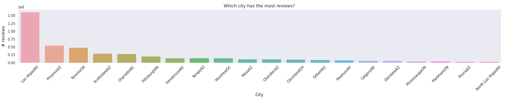
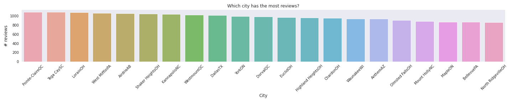
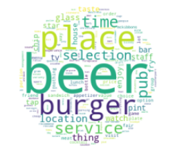
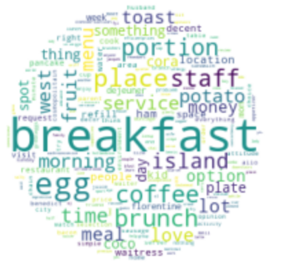
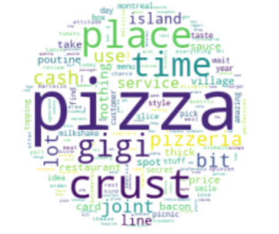
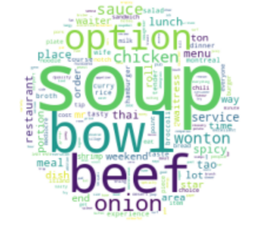
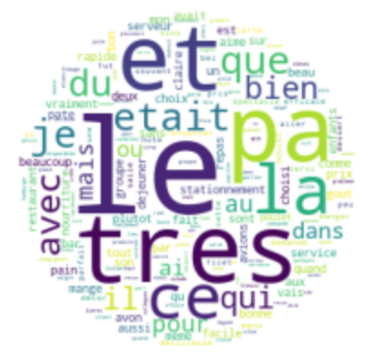
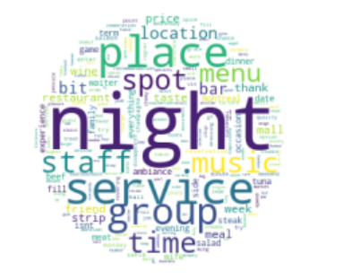

## Food (restaurant) Flora
*Finding Local Trends and Hidden Gems* 

When traveling to new and different places, the following questions always come up. 

"Where to do you want to eat?"  
"What's good around here?"  
"Should we try something local?"  

Due the coronovirus pandemic, traveling by plane has been brought to a hault resulting in the rise of popularity of roadtripping for vacation. The known popular places and restaurants are less accessible and traveling through new towns and cities is now on the rise. 

To answer the question, "Where do you want to eat?", I have always scoured through reviews, guides and recommendations to find what's popular but how do i find these guides for smaller places? I was thinking there must be a statistical way to read through volumes of local reviews to find what's truly popular. By using NLP and KMeans clustering, 

## Dataset

         

Yelp has provided a dataset from Kaggle originally put together for their "Yelp Dataset Challenge." It is composed of 5,200,000 user reviews of 174,000 businesses. It spans 11 metropolitan areas.

## Initial EDA

I wanted to view the cities with the most reviews to narrow down which cities to analyze. This showed the top 20 cities with the most reviews. 

  
For the city processed, I wanted to display a city with a far lower count of reviews. I chose Point-Claire QC.   
  

## The Method

From this dataset, I isolated just the reviews of Restaurants and Food places in the specific city. Once I isolated the reviews, I prepocessed the reviews to create a bag of word by tokenizing and lemmetization. Part of the preprocessing included removing all parts of speech except nouns.

## TF IDF

Next, I created a TD-IDF matrix of the Bag of Words to signify Term importance

## K Means Clustering

K mean clustering was then applied to this TD-IDF matrix

## The Results
Using the value of K=15, TD-IDF was clustered using KMEAN Clustering resulting in 15 clusters.

The following are the resulting cluster highlights. 

  

  

With this clustering you can find the general features of the restaurants in Point-Clare QC. You can Pizza and Breakfast to be popular places that have multiple mentions in their city.

But there are also gaps that occured the the Clustering. Since Point-Clare QC, is a location in French speaking Canada, a Cluster was dedicated to French Words. 

        

Also some restaurants and bars may have been associated more with nightlife rather than food thus displaying a cluster associated with night and service

        

